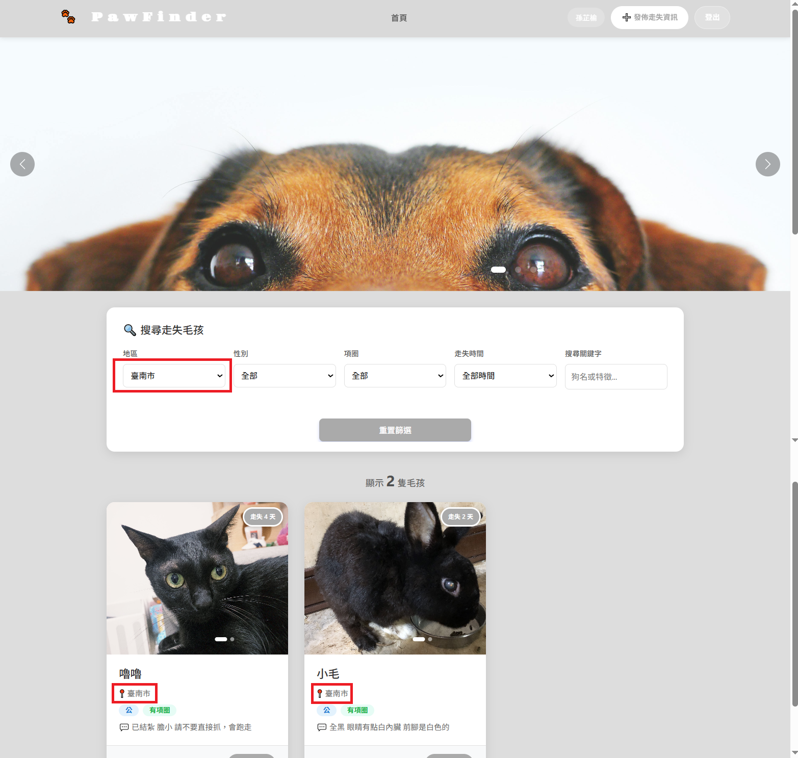
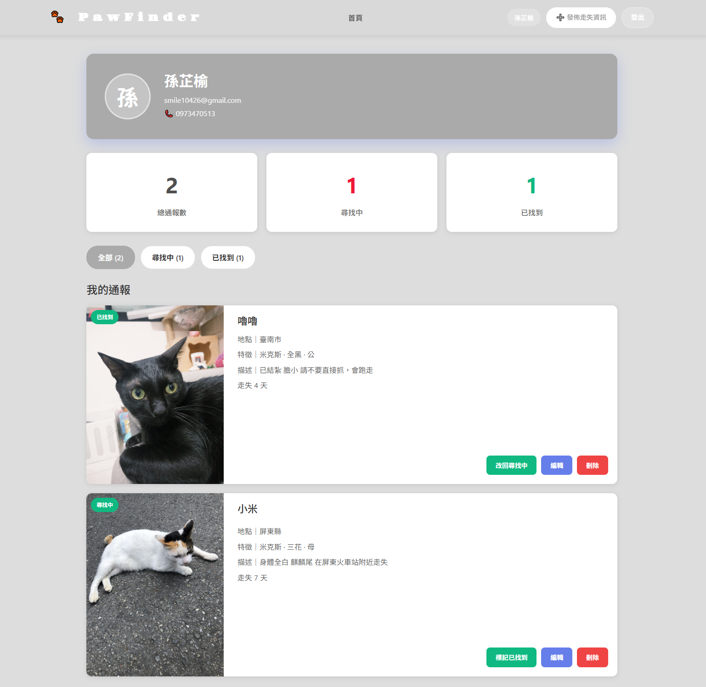

# 🐕 PawFinder - 走失毛孩協尋平台
> 這是一個為飼主與熱心民眾設計的公益平台。開發動機源於觀察到目前社群媒體（如 Facebook 社團）的走失資訊過於破碎、格式不一且難以檢索。我希望透過結構化的資料管理，提升毛孩被找回的機率。

[](https://pawfinder-zeta.vercel.app/)
[](https://reactjs.org/)
[](https://firebase.google.com/)

**[🌐Live Demo](https://pawfinder-zeta.vercel.app/)**

> [!TIP]
> **快速體驗**
> 使用測試帳號登入，查看管理後台與已發布的案例：
> - **帳號**：**`test@example.com`**
> - **密碼**：**`test123456`**
> 
> *( 註：您也可以自行註冊帳號體驗完整的通報發布流程 )*

## 為什麼開發這個專案？
> 目前寵物協尋多依賴社群平台（如 Facebook 社團），但常面臨以下痛點：

**現有問題分析**
* 資訊難以篩選：無法精確過濾地區或時間，熱心民眾難以尋找家附近的案例
* 狀態更新不即時：已找回的資訊仍持續干擾搜尋結果，造成資訊混亂
* 格式不統一：缺乏結構化欄位，導致關鍵特徵（如品種、項圈）容易漏掉

**解決方案**
我透過 React + Firebase 建立此平台，將散亂的資訊轉化為可篩選、可追蹤的有效數據。

---

## 技術架構

### 前端開發
- **React 18 (Hooks)**：全面採用 Functional Components，利用 useEffect 處理 Firebase 監聽，並透過 useContext 實作狀態共享。
- **Context API**：針對使用者認證（Auth）實作全域狀態管理。決策理由： 考量專案規模與維護成本，選擇輕量化的 Context API 替代 Redux，避免過度開發（Over-engineering）。
- **Responsive Design**：使用 CSS3 Flexbox/Grid 結合 Bootstrap，確保飼主在戶外使用手機時能有流暢的通報體驗。

### 後端服務(Firebase Serverless)
- **Cloud Firestore**：選擇 NoSQL 架構以因應欄位彈性需求。
  - **擴展性說明**：目前代碼中保留部分 `dog` 命名（如 `DogCard`），是因為初期以狗狗協尋為開發場景。
  - **通用設計**：底層資料結構與前端 Props 邏輯均採通用設計，僅需新增 `petType` 標籤就可以擴展至貓、兔等各類寵物。
- **Firebase Storage**：存放高解析度走失照片，並實作非同步上傳流程。
- **Security Rules**：透過後端規則定義資料存取權限，確保僅發布者本人具備修改權限。
```
allow update, delete: if request.auth.uid == resource.data.userId;
```

### 開發規範與工具
- **版本控制 (Git)**：遵循 Conventional Commits 規範進行提交，確保版本紀錄清晰、具備可讀性。
- **自動化部署 (CI/CD)**：整合 Vercel 實作自動化部署，確保代碼推送至 main 分支後即時更新線上版本。
- **套件管理**：使用 npm 進行相依性管理。

--- 

## 核心功能
* 權限管理：使用 Firebase Auth 搭配 Firestore Security Rules，將存取控制責任移至後端，避免僅依賴前端邏輯。
* 友善錯誤反饋系統：實作 errorHelper 機制，將後端回傳的技術性錯誤訊息（Firebase Error Codes）轉譯為人性化的中文通知。
* 智慧天數計算：自動根據走失日期動態顯示「走失天數」，幫助判斷案件緊急程度。
* 即時狀態切換：提供「尋找中」與「已找到」篩選，確保平台資訊即時有效。

---

## 技術挑戰與解決方案

> 這是專案開發過程中最核心的技術點

### 1. 搜尋功能與資料庫限制

**挑戰：**在實作同時篩選「地區」與「日期」時，發現 Firestore 資料庫對於多個範圍查詢有限制。

**解決方案：** 採取兩段式篩選策略。先從資料庫過濾出該「縣市」的資料，其餘細節（如日期或關鍵字）則在前端利用 JavaScript 的 filter() 處理。這讓我在不增加資料庫複雜度的情況下，依然能提供流暢的搜尋體驗。

### 2. 非同步多圖上傳與資料一致性

**挑戰：**確保多張寵物照片完整上傳，並與文字資訊同步寫入資料庫。

**解決方案：**
利用 **Promise.all()** 封裝上傳邏輯，確保所有圖片網址取得後才發送最後的 Firestore 請求，避免產生無效通報。

### 3. 基於後端的安全性控管

> 防止惡意竄改他人發布的資訊。

**解決方案：**
- 在後端建立驗證機制，只有當 `request.auth.uid == resource.data.userId` 時才允許 update/delete
- 確保即使有人繞過前端介面，也無法修改他人資料

---

## 開發環境設定
如果你想在本地端運行此專案，請參考以下步驟：

### 環境需求
- Node.js 14.0 以上
- npm 或 yarn

### 安裝步驟

1. **Clone 專案**
```bash
git clone https://github.com/olivia23sun/pawfinder.git
cd pawfinder
npm install
```

2. **設定環境變數**
> 請建立 .env 檔案並參考 .env.example 填入 Firebase 設定

3. **啟動開發伺服器**
```bash
npm start
```

---

## 專案截圖
 
### 1. 平台首頁與篩選功能
> 展示首頁與地區篩選即時顯示。


### 2. 通報發布流程
> 展示使用者填寫表單時，系統會即時生成圖片預覽，並透過Promise.all進行非同步上傳，確保資料完整性。


### 3. 個人管理中心
> 確保僅本人可編輯/刪除自有案件。


---

## 未來規劃

**地圖視覺化 (GIS 整合)：**串接 Google Maps API，將文字地址轉化為地圖標籤，讓協尋者能更直觀地掌握周遭的走失案例。
**即時通報系統：**整合瀏覽器推播通知 (Push API)，當特定區域有新通報時，第一時間通知附近的熱心民眾。
**影像辨識輔助：**規劃引入 AI 影像比對技術，自動過濾並提示特徵相似度較高的通報，降低人工篩選的時間成本。

---

## 聯絡方式

- **專案作者**：孫芷榆
- **Email**：smile10426@gmail.com
- **GitHub**：https://github.com/olivia23sun
